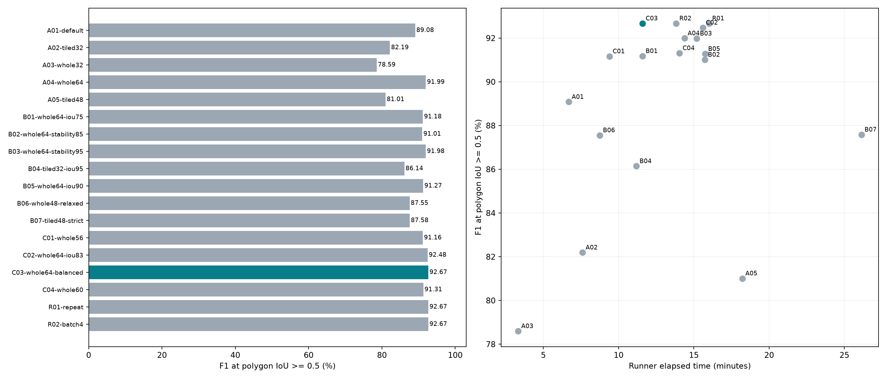
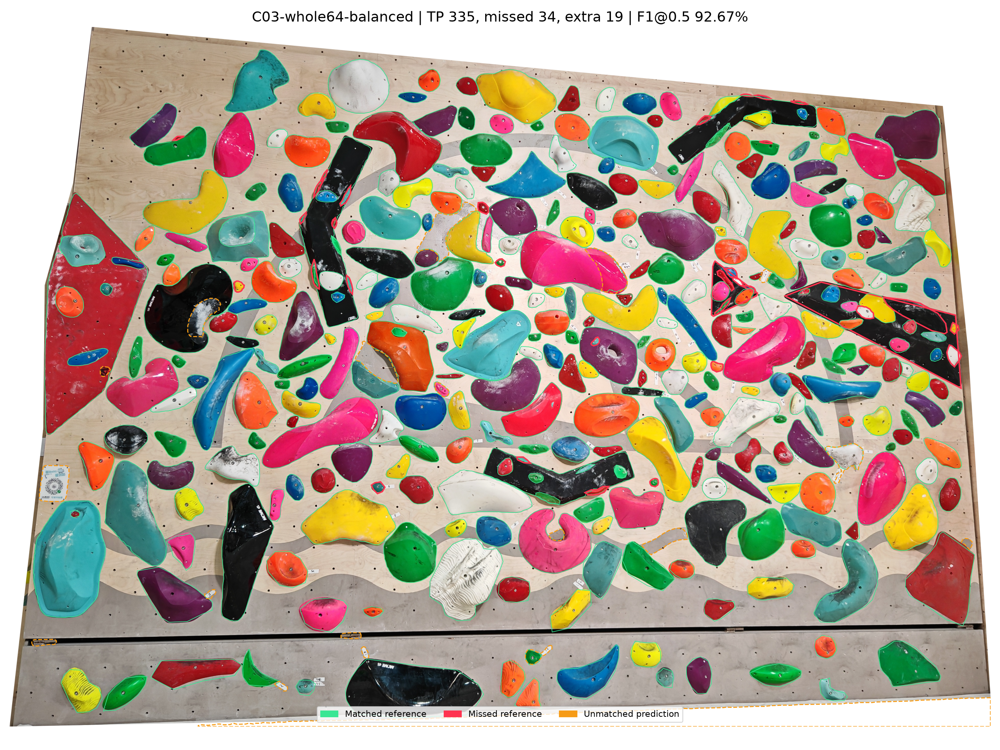
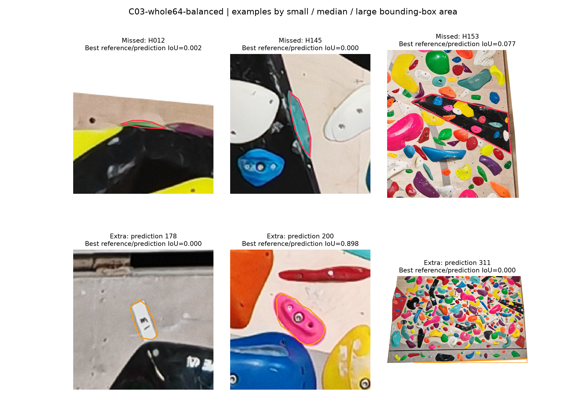

# 日坛墙面 SAM2.1 参数基线测试报告

完成时间：2026-09-13 17:59（北京时间）。

## 推荐结果

推荐 **C03-whole64-balanced**，模式 `sam2`，使用固定版本的 **SAM2.1 Hiera Large**。这是本轮已实测参数在这张墙图上的基线，并非所有墙面或无限参数空间的全局最优。

```json
{
  "points_per_side": 64,
  "points_per_batch": 8,
  "pred_iou_thresh": 0.83,
  "stability_score_thresh": 0.92,
  "crop_n_layers": 0
}
```

该组输出 **354** 个候选，与369个参考岩点一对一匹配后，**正确 335、误检 19、漏检 34**；精确率 **94.63%**，召回率 **90.79%**，F1 **92.67%**。严格轮廓匹配 F1@IoU0.75 为 **91.84%**，成功匹配的平均 IoU 为 **0.9603**，PQ 为 **0.8899**。

相较当前默认整图48点（F1 89.08%），F1变化 **+3.59 个百分点**，漏检由 59 变为 34，误检由 17 变为 19。执行器实测耗时 **11.59 分钟**（默认 6.68 分钟）。

可在[云端分割实验台](https://cruxset.xinyilab.top/segmentation-lab/)使用这些参数。输入实验 ID `748997f6-aa29-47bd-bad4-b56a888a534a`，推荐结果任务 ID `1e071469-21d0-4e99-8548-267086b10c5b`。推荐参数另存于 `recommended-baseline.json`。

## 输入与参考

- 原图：`日坛_spraywall_0822-wall.png`，3837×2737，18,247,911 字节，完整原始PNG作为每组输入。
- 输入 SHA-256：`ec5a0f9e8e4c6105e26875844415aad4e7223448cd222d7f04e1443805d02b5f`。
- 参考：3号墙“日坛spray0831”，`wall_9_PJELYaPR6p`，369个多边形，全部标记为hold。
- 云端参考轮廓已与本地实验 `432ebfbe-7718-4433-9a42-0265fb650120` 的校准 `67c468ef-3881-4c5d-9637-ceb8b2233f97` 逐点核对一致，冻结为 `reference.json`。
- 参考用于评分和选择参数，没有作为SAM的点提示、框提示或训练数据。没有为了凑369个结果而截断输出。

## 环境与资源

推理全部运行于公开仓库 `yanxinyi620/CruxSet` 的 GitHub Actions，现有 `segmentation-lab.yml`，Ubuntu 24.04 标准执行器，4核CPU、16GB内存，线程数4，同时最多两组。公开仓库标准执行器的资源与免费使用规则见 [GitHub官方文档](https://docs.github.com/en/actions/reference/runners/github-hosted-runners)。本地只进行调度、几何评分和报告绘制。

推理环境为Python 3.11；本地评分环境为Python 3.12，完整评分依赖已冻结于 `requirements-evaluation.txt`。

模型 `facebook/sam2.1-hiera-large`，权重版本 `665f8e2ad61cf5f53d65644ff27c8ee525124610`。分割实现与依赖基于提交 `85627b54a1a3b5505d5b54f871c3321ffc315c3d`；前期运行使用同一提交，随后固定到 `codex/sam21-baseline-20260913`。为处理GitHub手动触发接口异常，部分任务使用仅新增临时推送工作流的派生提交；已核对分割实现、后处理和依赖锁文件未改变。各实际提交与唯一新增文件见 `manifest.json` 的 `push_fallbacks`，每组运行提交见 `summary.csv`。使用锁定依赖：Transformers 5.16.1、PyTorch 2.13.0+cpu、NumPy 1.26.4、OpenCV 4.11.0.86。

从目标开始至本报告约 **2.48 小时**；已完成 **18 次**运行，累计作业时间 **241.0 分钟**（并行运行，所以不等于墙钟耗时）。执行器时间包括输入下载、模型加载、推理、后处理、打包上传；作业时间额外包括环境准备与收尾。没有将这些数字标为纯模型推理耗时。峰值内存来自 `/usr/bin/time` 的进程最大RSS，不是整台虚拟机总内存。

## 评估方法

将输出多边形与参考多边形顶点四舍五入到原图像素，在相同分辨率栅格化并计算IoU。对每一阈值执行最大匹配数量、继而最大IoU总和的一对一分配；重复或多余候选计入FP，未匹配参考计入FN。F1=2TP/(2TP+FP+FN)。主指标IoU≥0.5的F1，辅以IoU≥0.75的F1、平均匹配IoU、PQ、大小岩点召回和耗时。PQ=匹配IoU之和/(TP+0.5FP+0.5FN)。

岩点按参考像素面积划为三个等量组，各123个：小≤3749像素，中≤10487.33像素，其余为大。推荐组的匹配数：小 **92/123**，中 **123/123**，大 **120/123**。

推荐组的34个漏检中，有 **31个**属于最小面积组。因此整体F1的提升不代表小岩点已全部可靠检出，残留漏检仍需按图复核。

点密度指每边的采样点数，例如64表示64×64的均匀采样网格；分块模式对每一块分别采样。预定选择规则以F1@0.5为主；在距最高F1不超过0.5个百分点的组别中，优先检查F1@0.75，再比较耗时。数量差不参与排序。

评估器通过同轮廓、重复候选、非贪心最优匹配、空输出和不相交轮廓检查。以最终可发布多边形评分，不把模型自己的预测质量分数当成真实准确率。`offline-screening.json` 只用于缩小阈值搜索范围，其过滤结果没有冒充独立云端实验。

## 全部实测结果

| 组别 | 模式 | 点密度 | 质量阈值 | 稳定度 | 批量 | 输出数 | TP / FP / FN | F1@0.5 | F1@0.75 | 执行器分钟 | 峰值内存GiB |
|---|---|---:|---:|---:|---:|---:|---|---:|---:|---:|---:|
| A01-default | 整图 | 48 | 0.85 | 0.9 | 8 | 327 | 310 / 17 / 59 | 89.08% | 88.79% | 6.68 | 5.67 |
| A02-tiled32 | 四块 | 32 | 0.85 | 0.9 | 8 | 434 | 330 / 104 / 39 | 82.19% | 80.95% | 7.60 | 2.34 |
| A03-whole32 | 整图 | 32 | 0.85 | 0.9 | 8 | 257 | 246 / 11 / 123 | 78.59% | 78.27% | 3.33 | 4.53 |
| A04-whole64 | 整图 | 64 | 0.85 | 0.9 | 8 | 355 | 333 / 22 / 36 | 91.99% | 91.16% | 14.38 | 6.40 |
| A05-tiled48 | 四块 | 48 | 0.85 | 0.9 | 8 | 505 | 354 / 151 / 15 | 81.01% | 79.18% | 18.21 | 2.60 |
| B01-whole64-iou75 | 整图 | 64 | 0.75 | 0.9 | 8 | 379 | 341 / 38 / 28 | 91.18% | 90.11% | 11.59 | 6.73 |
| B02-whole64-stability85 | 整图 | 64 | 0.85 | 0.85 | 8 | 365 | 334 / 31 / 35 | 91.01% | 90.19% | 15.73 | 6.64 |
| B03-whole64-stability95 | 整图 | 64 | 0.85 | 0.95 | 8 | 329 | 321 / 8 / 48 | 91.98% | 91.69% | 15.19 | 5.81 |
| B04-tiled32-iou95 | 四块 | 32 | 0.95 | 0.9 | 8 | 367 | 317 / 50 / 52 | 86.14% | 85.87% | 11.18 | 2.19 |
| B05-whole64-iou90 | 整图 | 64 | 0.9 | 0.9 | 8 | 330 | 319 / 11 / 50 | 91.27% | 90.70% | 15.74 | 6.04 |
| B06-whole48-relaxed | 整图 | 48 | 0.8 | 0.85 | 8 | 346 | 313 / 33 / 56 | 87.55% | 87.55% | 8.75 | 6.06 |
| B07-tiled48-strict | 四块 | 48 | 0.95 | 0.95 | 8 | 380 | 328 / 52 / 41 | 87.58% | 87.32% | 26.13 | 2.35 |
| C01-whole56 | 整图 | 56 | 0.85 | 0.9 | 8 | 344 | 325 / 19 / 44 | 91.16% | 90.32% | 9.40 | 6.08 |
| C02-whole64-iou83 | 整图 | 64 | 0.83 | 0.9 | 8 | 362 | 338 / 24 / 31 | 92.48% | 91.38% | 15.59 | 6.53 |
| C03-whole64-balanced | 整图 | 64 | 0.83 | 0.92 | 8 | 354 | 335 / 19 / 34 | 92.67% | 91.84% | 11.59 | 6.35 |
| C04-whole60 | 整图 | 60 | 0.85 | 0.9 | 8 | 356 | 331 / 25 / 38 | 91.31% | 91.31% | 14.04 | 6.33 |
| R01-repeat | 整图 | 64 | 0.83 | 0.92 | 8 | 354 | 335 / 19 / 34 | 92.67% | 91.84% | 16.01 | 6.36 |
| R02-batch4 | 整图 | 64 | 0.83 | 0.92 | 4 | 354 | 335 / 19 / 34 | 92.67% | 91.84% | 13.83 | 6.37 |



## 参数比较的结论

1. **采样密度比单纯放宽阈值更关键。** 默认阈值下，整图32点只匹配246个，48点匹配310个，64点匹配333个；漏检主要集中于小岩点。48点同时放宽质量与稳定度后F1只有87.55%，未改善默认48点的89.08%。56和60点的实际结果见表，避免直接假设点数越大一定越好。
2. **当前分块流程有较高召回，但额外轮廓代价很大。** 四块48点默认组匹配354个、漏检15个，同时误检151个，F1仅81.01%。四块32点质量阈值提高到0.95后，误检降到50个，F1为86.14%；不足以仅凭更高召回就选作基线。更严格的四块48点组也按完整输出独立评分。
3. **阈值存在折中。** 整图64点质量阈值降到0.75后，增加的误检抵消了召回收益，F1为91.18%；升到0.90则漏检50个，F1为91.27%。稳定度降至0.85只比0.90多找到1个参考岩点，却增加9个误检；升到0.95把误检降至8个，同时漏检增至48个。因此补测了质量0.83与稳定度0.92等中间值。
4. **推荐遵循预定评分规则。** 主比较中最高F1为 **C03-whole64-balanced / 92.67%**；推荐 **C03-whole64-balanced / 92.67%**，同时参考严格轮廓匹配和运行成本。主F1差距在0.5个百分点内时视作近似候选，优先严格轮廓匹配，而非按输出数量接近369排序。

## 复测与批量验证

- R01-repeat：批量8，TP/FP/FN=335/19/34，F1 92.67%，F1@0.75 91.84%，执行器16.01分钟，峰值RSS 6.36GiB。
- R02-batch4：批量4，TP/FP/FN=335/19/34，F1 92.67%，F1@0.75 91.84%，执行器13.83分钟，峰值RSS 6.37GiB。

- R01-repeat 相对 C03-whole64-balanced：354/354 个轮廓以IoU≥0.99匹配，匹配平均IoU=1.000000；原图像素栅格化后全部轮廓完全一致：是。
- R02-batch4 相对 C03-whole64-balanced：354/354 个轮廓以IoU≥0.99匹配，匹配平均IoU=1.000000；原图像素栅格化后全部轮廓完全一致：是。

同参数复测使用新的GitHub运行；批量4组保留同样的模型、采样密度和阈值，仅改变每批提示点数量。它们用于检验基线稳定性和内存/耗时取舍，不是新增图片上的泛化测试。

**批量保留8。** 批量8的两次执行器耗时为11.59和16.01分钟，批量4为13.83分钟，处于上述波动范围内；三次峰值RSS均约6.35–6.37GiB。批量4没有显示出明确的速度或峰值内存优势，而轮廓完全相同，因此沿用批量8作为基线。当前证据不足以断言哪种批量在所有执行器上更快。

调度过程中的异常另存 `incidents.json`：部分手动提交收到GitHub HTTP500响应，其中C03后来确认已被接收；后续使用分支推送事件启动相同执行器。恢复时沿用同一task/attempt标识，利用原子领取防止重复推理。临时分支只增加任务启动工作流，没有修改模型、后处理、参数或图片。所有评分均以实际成功输出为准，提交延迟不计为模型推理耗时。

## 误差可视化

绿色是匹配到的参考轮廓，红色是漏检参考，橙色虚线是未匹配预测。颜色按IoU≥0.5的一对一匹配生成。

橙色轮廓也可能覆盖真实岩点：同一岩点重复输出时，只允许一个预测计为正确，其余计为FP。局部图按遗漏/额外轮廓的包围盒面积选择小、中、大三个例子，避免只挑好看的区域。





默认组叠图见 `A01-default/overlay.png`；各组完整候选、每个匹配的IoU与索引均已保存，可追溯每个计分项。

## 适用边界

本轮在单张图片上调参并用同张图片选择基线，没有独立留出墙面，指标属于对指定校准参考的拟合质量。参考本身来源于既有SAM结果与人工校准，并非独立重新标注的绝对真值。不能从本报告推断其他墙面上的准确率。候选数与369接近也不代表准确，误检和漏检可以相互抵消。

每次GitHub运行使用独立虚拟机，加载、网络与执行速度会波动；单次耗时差不能全部归因于参数。复测用于检查结果稳定性和耗时范围，不提供跨硬件的严格性能保证。

整图和四块方案沿用同一现有发布后处理（超大面积过滤与去重）；内部裁剪层固定0。分块为四个宽高各约原图60%的区域，相邻重叠约原图相应尺寸的20%。本轮没有通过修改后处理或人工删选结果来提高分数。

## 复核材料

- `summary.csv` / `summary.json`：完整参数、指标、耗时、运行链接。
- `recommended-baseline.json`：可复用参数与推荐结果信息。
- `reference.json` / `manifest.json`：冻结参考、校验和、环境与评估记录。
- 每组目录：`candidates.json`、`metrics.json`、`iou.npy`、`github.json`、`github.log`。
- `evaluate.py`：可复算评分；`design.md`：预定评估准则与实验范围。

GitHub运行记录：

- [A01-default](https://github.com/yanxinyi620/CruxSet/actions/runs/34745480003)
- [A02-tiled32](https://github.com/yanxinyi620/CruxSet/actions/runs/34745489589)
- [A03-whole32](https://github.com/yanxinyi620/CruxSet/actions/runs/34745801228)
- [A04-whole64](https://github.com/yanxinyi620/CruxSet/actions/runs/34745836108)
- [A05-tiled48](https://github.com/yanxinyi620/CruxSet/actions/runs/34745976448)
- [B01-whole64-iou75](https://github.com/yanxinyi620/CruxSet/actions/runs/34746437239)
- [B02-whole64-stability85](https://github.com/yanxinyi620/CruxSet/actions/runs/34746742675)
- [B03-whole64-stability95](https://github.com/yanxinyi620/CruxSet/actions/runs/34746959152)
- [B04-tiled32-iou95](https://github.com/yanxinyi620/CruxSet/actions/runs/34747417981)
- [B05-whole64-iou90](https://github.com/yanxinyi620/CruxSet/actions/runs/34747636448)
- [B06-whole48-relaxed](https://github.com/yanxinyi620/CruxSet/actions/runs/34747923081)
- [B07-tiled48-strict](https://github.com/yanxinyi620/CruxSet/actions/runs/34749128728)
- [C01-whole56](https://github.com/yanxinyi620/CruxSet/actions/runs/34748337865)
- [C02-whole64-iou83](https://github.com/yanxinyi620/CruxSet/actions/runs/34748341530)
- [C03-whole64-balanced](https://github.com/yanxinyi620/CruxSet/actions/runs/34748674339)
- [C04-whole60](https://github.com/yanxinyi620/CruxSet/actions/runs/34749087622)
- [R01-repeat](https://github.com/yanxinyi620/CruxSet/actions/runs/34749634141)
- [R02-batch4](https://github.com/yanxinyi620/CruxSet/actions/runs/34749999280)
